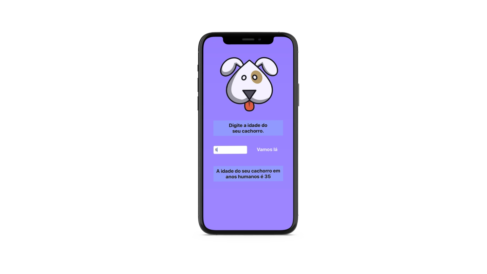

<h1 align="center">
    DogAge
</h1>

  

  

## 💻 Projeto

O DogAge App é um projeto criado exclusivamente para fins acadêmicos a fim de se aplicar conteitos báscios de Swift.

## :memo: Licença

Esse projeto está sob a licença MIT. Veja o arquivo [LICENSE](LICENSE) para mais detalhes.

---

Feito por Daniel Sousa :wave: [LikedIn](https://www.linkedin.com/in/danielsousast/)
